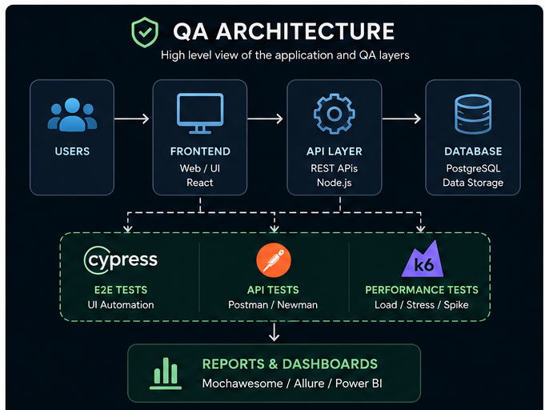
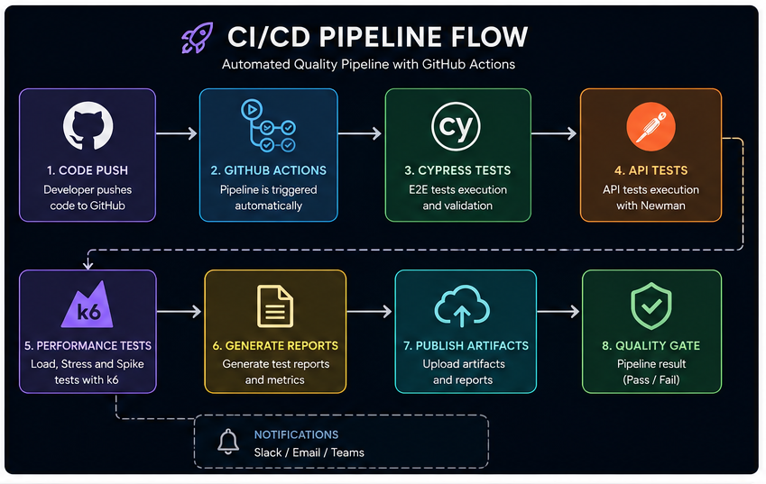
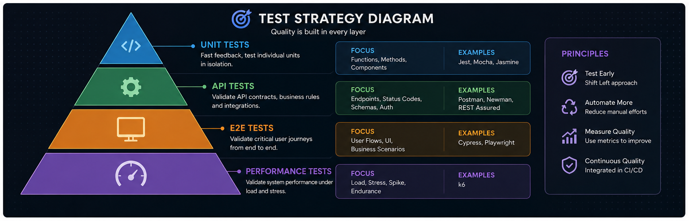

# 🚀 QA Engineering Lab

QA Engineering Lab is a practical Quality Engineering ecosystem focused on:

- End-to-End Test Automation
- API Validation
- Performance Engineering
- CI/CD Quality Pipelines
- Reporting & Observability
- Scalable QA Architecture

This repository centralizes studies, experiments, best practices and real-world quality engineering strategies using modern tools adopted by the market.

---

# 🎯 Project Goals

- Build scalable and reusable test automation
- Demonstrate modern QA best practices
- Validate critical APIs and business flows
- Implement performance testing strategies
- Structure CI/CD quality pipelines
- Improve software reliability and observability
- Apply Quality Engineering concepts in real scenarios

---

# 🏗️ QA Architecture

## Quality Engineering Architecture

<p align="center">
  
</p>

This architecture demonstrates how automation, APIs, performance testing and CI/CD integrate into a continuous quality ecosystem.

---

# ⚙️ CI/CD Pipeline Flow

<p align="center">
  
</p>

## Automated Pipeline

```txt
Code Push
   ↓
GitHub Actions
   ↓
API Tests (Postman/Newman)
   ↓
E2E Tests (Cypress)
   ↓
Performance Tests (K6)
   ↓
Reports Generation
   ↓
Quality Gate
   ↓
Artifacts & Dashboards
```

---

# 🧪 Test Strategy Diagram

<p align="center">
  
</p>

### Testing Strategy

- Shift Left Testing
- Continuous Testing
- Risk-Based Testing
- Performance Validation
- Automated Quality Gates
- Observability & Metrics

---

# ⚡ Main Stack

## QA & Automation

- Cypress
- Postman
- Newman
- K6
- JavaScript

## CI/CD & DevOps

- GitHub Actions
- Azure DevOps

## Metrics & Observability

- Power BI
- Mochawesome
- Allure Reports

## Data & Backend

- SQL
- JSON

---

# 📂 Project Structure

```bash
qa-engineering-lab/
│
├── architecture/
│
├── cypress/
│   ├── e2e/
│   ├── fixtures/
│   ├── support/
│   ├── reports/
│   └── screenshots/
│
├── api/
│   ├── collections/
│   ├── environments/
│   └── reports/
│
├── performance/
│   ├── smoke/
│   ├── load/
│   ├── stress/
│   ├── spike/
│   └── reports/
│
├── docs/
│
├── flaky-tests/
│
├── ci-cd/
│
└── .github/
    └── workflows/
```

---

# 🧪 End-to-End Automation

Automation structure using Cypress focused on scalability and maintainability.

## Features

- Page Objects
- Fixtures
- Custom Commands
- API Intercepts
- Session Handling
- Retry Strategies
- Automated Reports
- Screenshots & Videos

## Scenarios Implemented

- Login
- User Registration
- Checkout
- Expired Session
- Critical E2E Flows

---

# 🔌 API Testing

REST API testing strategies using Postman and Newman.

## Coverage

- Status Code Validation
- JSON Schema Validation
- Authentication via Token
- Environment Variables
- Critical Business Flows
- Automated Reports

## CI Integration

API tests are automatically executed through GitHub Actions pipelines.

---

# 🚀 Performance Testing

Performance testing strategy using K6.

## Test Types

- Smoke Tests
- Load Tests
- Stress Tests
- Spike Tests

## Metrics Analyzed

- Response Time
- Throughput
- Error Rate
- Thresholds
- Performance Bottlenecks

---

# ⚙️ CI/CD

Automated quality pipelines using GitHub Actions.

## Workflows

- Cypress Tests
- API Tests
- Performance Tests

## Goals

- Continuous Quality
- Fast Feedback
- Automated Validation
- Scalable Testing Pipelines

---

# 📊 Reports & Observability

This project includes quality reports and execution artifacts for better visibility and analysis.

## Reports

- Cypress Reports
- Newman Reports
- K6 Metrics
- Execution Logs
- Failure Analysis

## Observability

- Pipeline Visibility
- Performance Metrics
- Quality Indicators
- Continuous Monitoring

---

# ▶️ How to Run

## Install Dependencies

```bash
npm install
```

---

## Run Cypress Tests

```bash
npm run cy:run
```

---

## Open Cypress UI

```bash
npm run cy:open
```

---

## Run API Tests

```bash
npm run api:test
```

---

## Run K6 Smoke Tests

```bash
npm run k6:smoke
```

---

## Run K6 Load Tests

```bash
npm run k6:load
```

---

## Run K6 Stress Tests

```bash
npm run k6:stress
```

---

## Run K6 Spike Tests

```bash
npm run k6:spike
```

---

# 📈 Quality Engineering Principles

This lab follows modern Quality Engineering concepts:

- Continuous Testing
- Shift Left Testing
- Test Automation Strategy
- DevOps Culture
- Quality Metrics
- Scalable QA Architecture
- Observability
- Continuous Feedback

---

# 🔥 Future Improvements

- Allure Reports
- Docker Integration
- Visual Testing
- Contract Testing
- Accessibility Testing
- Parallel Execution
- Grafana Dashboards
- AI-generated Test Scenarios
- AI-powered Failure Analysis
- Flaky Test Detection

---

# 📸 Future Visual Evidence

Planned additions:

- GIFs of Cypress execution
- CI/CD workflow recordings
- K6 dashboards
- Automated reports screenshots
- Quality metrics dashboards

---

# 👩‍💻 Author

# Mariele De Bona

QA Engineer focused on:

- Test Automation
- API Testing
- Performance Engineering
- Continuous Quality
- Quality Architecture

---

# 🔗 Connect With Me

### LinkedIn

https://www.linkedin.com/in/mariele-de-bona-qa

### GitHub

https://github.com/mariele-de-bona-qa
